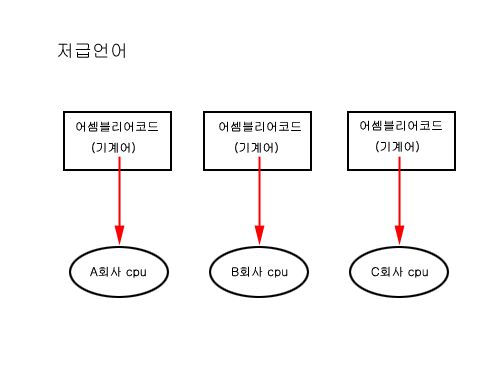
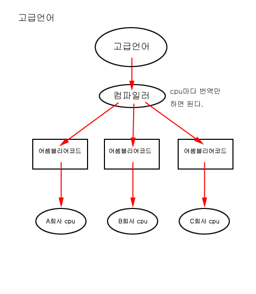

# 01 자바 개념정리 _ 인터프리터와 컴파일러 차이?

1. 인터프리터란? ( = 번역가)
	- 작성한 **프로그램을 한줄 씩 번역** 하면서 실행 시켜 나아가는 것
2. 컴파일러란? ( = 통역가)
	- 사용자가 작성한 **프로그램 전체** 를 기계어로 편집하는 것

#### * 인터프리터와 컴파일러 차이? ####

	컴파일러는 결과물로서 하나의 실행 파일을 만들어 내지만 컴파일러는 실행파일을 
    생성하지는 않는다.
    즉, 인터프리터는 번역 당시에만 프로그램 실행 명령을 만들어 내고 생성 후에는 사라진다. 
    컴파일러는 한번 실행 한 후 그것을 적재시켜 나중에 재사용할 때 다시 처음 부터 실행 시키
    지 않고 불러내 사용한다.
    
    인터프리터 경우에는 실행 시킬 때 마다 번역이 실행 되므로 시간이 많이 걸리지만, 컴파일러
    같은 경우에는 한번 실행하게 되면 실행파일이 생기므로 수행 속도가 빠르다.
    또한 컴파일러는 컴파일 시 전체 프로그램이 생성되므로 메모리 사용량 증가!
    (=> 메모리 부족 에러가 나타남)
    
    
    
    
#### * 저급언어, 어셈블리어, 고급언어 ####

고급언어와 저급언어의 나누는 기준은 사람이 접근하기 쉬운가 안쉬운가에 따라 나누어져 있다.

사람에게 친숙한 언어일 수록 고급(High)언어로 속하고, 컴퓨터가 알아 볼수 있는 언어로 가깝다면 저급(Low)로 속한다.

##### * 고급언어 #####
1. 사람이 이해하기 쉽게 작성된 프로그래밍 언어 이다.
	- **고급언어 특징**
		- 저급 프로그래밍 언어 보다 가독성이 높고 다루기 간단하다.
		- C언어, 자바 등 대부분의 프로그래밍 언어들은 고급언어에 속한다.
		- 저급언어와는 다르게 특정 컴퓨터와 관계없이 독립적으로 프로그램을 만들 수 있다.
		- 고급언어를 컴퓨터 언어인 기계어로 변환하기 위해 컴파일러와, 인터프리터 등이 있다.
		- 기계어로 변환하는 동안 시간이 소요되며 저급언어보다 프로그램 크기가 더 크다.

##### * 저급언어 #####
1. 컴퓨터가 이해하기 쉬운 이진법으로 이루어진 언어이다.
	- **저급언어 특징**
		- 0과 1로만 이루어져 있어 컴퓨터가 바로 이행할 수 있지만, 가독성과 생성선이 낮으며 컴퓨터마다 언어가 다른다.
		- 기계어와 어셈블리어가 있음
			- 기계어란?
				- CPU가 직접 해독하고 실행 할 수 있는 비트단위로 쓰인 컴퓨터 언어를 일컫음.
				- 프로그램을 나타내는 가장 낮은 단계의 개념
			- 어셈블리어?
				- 기계어와 1:1 대응이 되는 컴퓨터 프로그래밍의 저급언어이다

**고급언어 -> 어셈블리어 -> 저급언어**

- 컴퓨터 마다 사용하는 기계어가 다르고 기계어에 대응되어 만들어 지는 어셈블리어도 
각각 다르다. 그렇게 때문에 어떤 A회사에 CPU에 대응되는 어셈블리어 코드를 B회사에 CPU에 대응하지 못하고 
각각 회사에 맞게 CPU에 맞게 작성해야 한다. 
이러한 불편합을 막기 위한 것이 **고급언어** 이다.

이렇듯 컴파일러에서 cpu에 맞게 번역만해주기만하면
cpu마다 다르게 코드를 만드는것을 줄여주게된다.
그래서 고급언어가 편한이유가 여기에 있다.

컴파일러는 전처리기와 번역기로 되어있다.
전처리기는 사전작업을 하느것으로 조금 수정을하고 번역기에서 번역을하는 과정을 거친다.
영어회화를 번역하는것을 예로들면 띄어쓰기,오타체크등 수정등을 하는것을 전처리기라고 생각하면되고, 이렇게 수정된 영어를 번역하는것을 번역기라고 생각하면 된다.

출처: http://sessionk.tistory.com/122 []