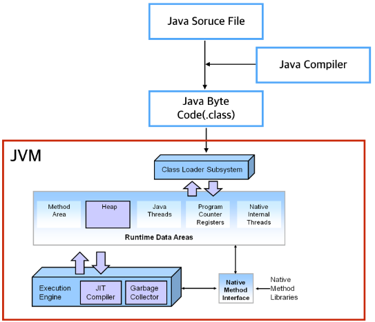
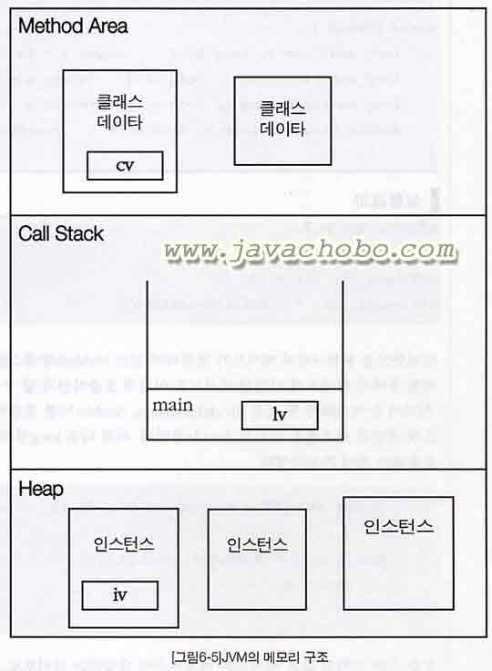

# 01 자바 개념정리 _ JAM, JAM 메모리구조

### * JVM (Java virtual machine) 이란? ###
1.  자바를 실행하기 위한 가상 기계
2.  일반 프로그램은 **운영체제가 프로그램**을 실행시킨다. 자바 프로그램은 운영체제가 **JVM을 실행시키면 JVM이 프로그램(클래스파일)을 실행** 시킨다. 
3. 자바 클래스파일들은 운영체제에서 직접 동작하는게 아니라 JVM위에서 동작한다. 윈도우에서 개발한다면 윈도우용 JVM을 설치하고, 맥에서 개발한다면 맥용 JVM을 설치하고 .. JVM만 설치가 되어 있다면, 자바 프로그램은 한번 만들기만 하면 윈도우든 맥이든, 어느 운영체제든 상관없이 실행 가능하다. 이를 **플랫폼 독립성** 이라고 한다.

출처: http://gbsb.tistory.com/2

#### * JVM 실행과정 ####
1. 프로그램이 실행되면 JVM OS로부터 프로그램에 필요한 메모리를 할당 받는다,
2. 자바컴파일러 (Javac)가 자바소스코드(.*java)파일을 컴파일하여 자바 바이트(.class)로 변환시킨다.
3. Class Loader을 통해 class파일들을 Jvm으로 로딩한다
4. 로딩된 class파일들은 Execution engine을 통해 해석된다
5. 해석된 바이트코드는 Runtime Data Area에 배치되어 실질적인 수행이 이루어진다

#### * JVM 구조 ####

1. 프로그램이 실행이되면, JVM은 OS으로부터 이 프로그램이 필요로 하는 메모리를 할당 받고 이 메모리를 용도에 따라 여러 영역으로 나누어 관리함. 
2. JVM은 크게 3가지로 나눌수 있음.클래스 파일을 로딩한 뒤 검증하고 초기화하는 **Class loader subSystem**, 클래스 파일을 저장하는 **Runtime DataArea**(이곳은 다시 method area, heap, java stacks, pc registers, native method stacks의 5가지 영역으로 나누어집니다), 클래스 파일(바이트코드)를 플랫폼에 맞는 기계어로 변환시켜 실행하는 **Execution engine** 입니다.

#### * JVM 메모리구조 ####

1. 메소드 영역(Method Area)
 - 프로그램 실행 중 어떤 클래스가 사용되면, JVM은 해당 클래스의 클래스파일(.*class)을 읽어서 분석하여 클래스에 대한 정보를 MEthod Area에 저장한다.
 - 이때, 그 클래스의 클래스 변수도 이 영역과 함께 생성된다.
2. 힙(Heap)
 - 인스턴스가 생성되는 공간. 프로그램 실행 중 생성되는 인스터스는 모두 이곳에 생성됨. 
 - 즉, 인스턴스 변수(instance Variable)이 생성되는 공간임
3. 호출스택(Call stack or Exection Stack)
 - 메서드의 작업에 필요한 메모리 공간을 제공함.
 - 메서드가 호출이 되면, 호출스택에 호출 된 메서드를 위한 메모리가 할당되며, 이 메모리는 메서드가 작업을 수행하는 동안 지역변수(매개변수 포함)들과 연산의 중간결과 등을 저장하는데 사용된다.
 
 
