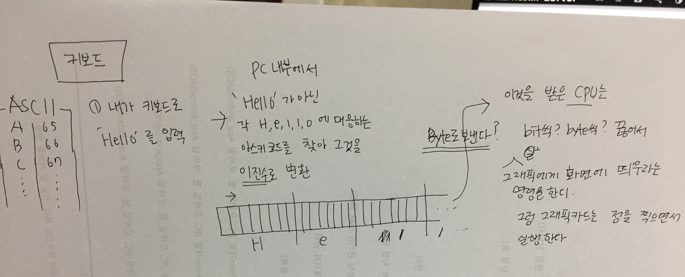

# bit, byte, ASCII

##### 1bit는 왜 8byte인가?
1. bit란? 컴퓨터가 알아 들을 수 있는 0,1을 넣을 수 있는 데이터 공간.
2. 왜 8bit인가?

	ASCII(American Standard code for Information Interchange) 
   
   : 미국인이 정한 표준 코드 교환
   
   미국인들이 양방향 통신을 하기 위해 공통으로 쓰일 수 있는 아스키코드를 만들었다.
   기본적으로 모든 아스키코드로 한글자를 표현하는데에 7bit가 충분하다고 생각하여 한글자를 보내는데 7bit로 정하였다.
   한글자당 0,1이 들어 갈수 있다. 총 7bit에 0,1이 들어갈 수 있는 경우의 수는 128개이다.
   
   
   * 7bit -> 8bit?
   		* 데이터 송수신의 오류를 검출하기 위한 패리티 비트로 1비트가 추가되어 8it이다.
	
	8bit = 1byte

 * 사람들이 'Hello' 라는 것을 보낼 때'H', 'e', 'l', 'l', 'o'라는 각 문자에 대응된 숫자 만큼 전등을 깜박이면 된다.
 각 대응된 숫자만큼 깜박이느냐? 그건아님
 = > 각 아스키코드에 대응하는 숫자 만큼 전등이 깜박거리는게 아니라 이진수로 표현된 것을 전등으로 표현을 하면 된다고 생각하면 된다.
 전등이 꺼지면 0 , 켜지면 1
 각 숫자마다 1초씩이라고 생각하면 됨.
 
 ex ) 'e' 01100101 
 1초는 전등을 껐다가 2초간 전등을 키고 또 2초만큼 전등을 끄고 1초키고 0초 끄고 1초 키고.. 
 
 https://kldp.org/node/110311
 

3. 내가 7을 입력하면 어떻게 컴퓨터 메모리에 담기는가?

	키보드 A를 입력을 하면 아스키코드에 대응되는 값을 보내 2진수 바꿔서 CPU에게 보내준다. 
